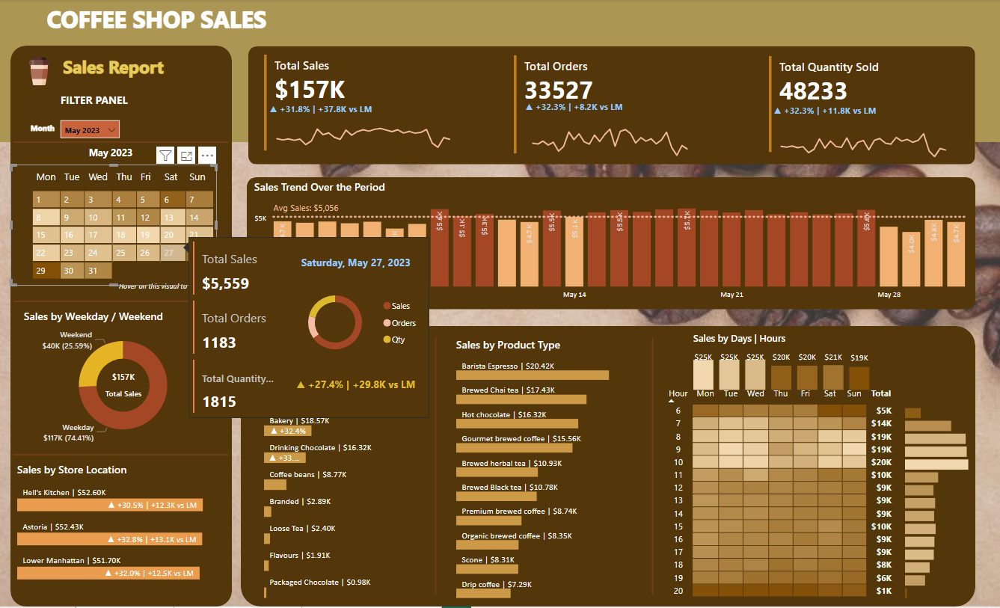

# Coffee Shop Sales Dashboard
## Problem Statement

The goal of this Power BI project is to analyze sales data for a coffee shop. The analysis focuses on understanding sales trends and key performance indicators (KPIs) to support business decisions.

## KPI's Requirements

1. **Total Sales Analysis:**
   - Calculate the total sales for each respective month.
   - Determine the month-on-month increase or decrease in sales.
   - Calculate the difference in sales between the selected month and the previous month.

2. **Total Orders Analysis:**
   - Calculate the total number of orders for each respective month.
   - Determine the month-on-month increase or decrease in the number of orders.
   - Calculate the difference in the number of orders between the selected month and the previous month.

3. **Total Quantity Sold Analysis:**
   - Calculate the total quantity sold for each respective month.
   - Determine the month-on-month increase or decrease in the total quantity sold.
   - Calculate the difference in the total quantity sold between the selected month and the previous month.

